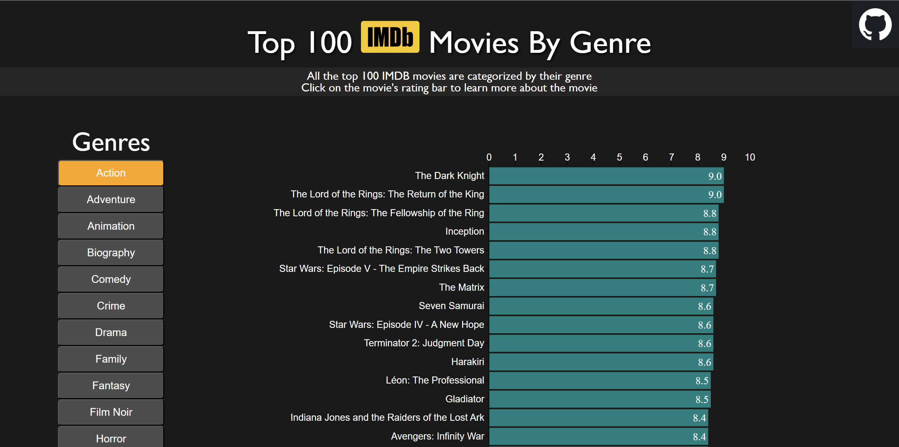
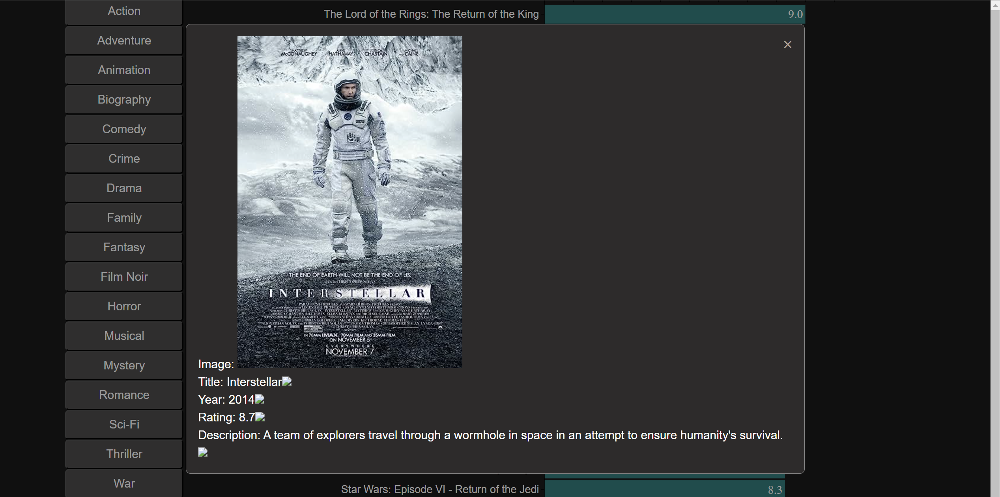

<h2>Background</h1>

<a href="https://joshk57.github.io/Top-100-IMDB-Movies-By-Genre/">Top 100 IMDB Movies By Genre</a> is a data visualization of the top 100 IMDB movies categorized by their genre and then sorted by their rating. Users can click on a specific genre to view a horizontal bar chart that shows the movie's title and their rating. Users will also be able to click on a movie's bar rating to learn more about that movie.

The motivating factor for this data visualization is because I'm an avid movie enjoyer and whenever I look for a movie to watch, I would always try to find the highest rated movies to watch. I figured why not just create a ranking of the top movies of my own and then be able to see what each movie is about when I click on the movie.

<h2>Functionality & MVPS</h2>

<h3>In "Top 100 IMDB Movies By Genre", users will be able to:</h3>

<h4>Click on the genres to see a visual representation of each movie's rating through a horizontal bar chart</h4>



In order to obtain our data, we need to make a fetch request to the API and then format the result array into a new array with a key value pair of just the title and rating.
```
export async function fetchMovies(arg) {
    const url = 'https://imdb-top-100-movies.p.rapidapi.com/';
    const options = {
        method: 'GET',
        headers: {
            'X-RapidAPI-Key': 'acd4d417f3msh22cbb2688691676p165cfcjsn3f566e20b85c',
            'X-RapidAPI-Host': 'imdb-top-100-movies.p.rapidapi.com'
        }
    };

    try {
        const response = await fetch(url, options);
        const result = await response.json();
        let action_data = [];
        
        result.forEach(ele => {
            if (ele["genre"].includes(arg)) {
                let hash = {}
                hash["title"] = ele["title"]
                hash["rating"] = ele["rating"]
                action_data.push(hash)
            };
        });
        return action_data;
    } catch (error) {
        console.error(error);
    };
};
```

<h4>Click on each bar to view a modal that provides more information about that movie</h4>



In order to display more information about a movie, I used a modal that would pop out after click on the rating bar.
```
export function movieModal(event, data) {
    const modal = document.querySelector(".modal");
  
    if (event.target === event) {
      modal.style.display = "block";
    }
  
    const movieDetails = document.getElementById('movie-details');
    movieDetails.innerHTML = '';
  
    const detailsList = document.createElement('ul');

    const image = createListItem('Image', '', data[0]);
    detailsList.appendChild(image);

    const title = createListItem('Title', data[1]);
    detailsList.appendChild(title);

    const year = createListItem('Year', data[2]);
    detailsList.appendChild(year);

    const rating = createListItem('Rating', data[3]);
    detailsList.appendChild(rating);

    const description = createListItem('Description', data[4]);
    detailsList.appendChild(description);

    movieDetails.appendChild(detailsList);
  }
  
function createListItem(key, value, imgURL) {
    const listItem = document.createElement('li');

    const labelElement = document.createElement('span');
    labelElement.textContent = key + ': ';
    listItem.appendChild(labelElement);

    const valueElement = document.createElement('span');
    valueElement.textContent = value;
    listItem.appendChild(valueElement);

    const imgElement = document.createElement('img');
    imgElement.src = imgURL;
    listItem.appendChild(imgElement);

    return listItem;
}
```

<h2>Technologies, Libraries, APIs</h2>
<ul>
    <li>D3.js</li>
    <li>https://rapidapi.com/rapihub-rapihub-default/api/imdb-top-100-movies</li>
</ul>

<h2>Implementation Timeline</h2>
<ul>
    <li>Thursday: Find the API that I want to use.</li>
    <li>Friday: Start learning how to fetch and obtain the data from my API.</li>
    <li>Saturday and Sunday: Learn how to use D3.js and be able to click on a button to start displaying my data in a bar graph.</li> 
    <li>Monday: Continue to work on displaying data while also working on CSS<li>
    <li>Tuesday: Fetch more information about a specific movie in order to display it in a modal.</li>
    <li>Wednesday: Finish working on the modal and then continue to work on CSS.</li>
    <li>Thursday: Finish what I can with styling and then deploy the project on GitHub.</li>
</ul>

<h2>Future Implementations</h2>
<ul>
    <li>Possibly include a search function</li>
    <li>Instead of just top 100 movies, include every movie in IMDB</li>
    <li>Find the ratings of a movie also from Rotten Tomatoes and Metacritic. Then calculate the average rating using the three review sites</li>
    <li>Provide a trailer to the movies in the modal</li>
    <li>Provide links to streaming services where the user can watch that movie</li>
<ul>